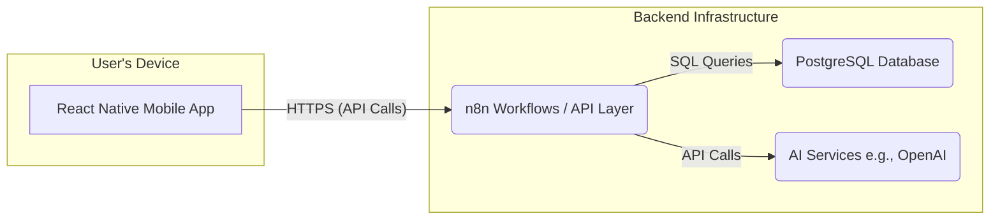

# Real Estate CRM - System Architecture Overview

This document outlines the high-level architecture for the custom AI-empowered mobile CRM.

## 1. Overview

The Real Estate CRM is designed as a three-tier application with additional AI service integration:

1.  **Frontend (Client-Tier):** A React Native mobile application providing the user interface for real estate agents.
2.  **Backend (Application-Tier):** n8n serves as the backend, hosting API endpoints (via webhooks), orchestrating workflows, and managing business logic.
3.  **Database (Data-Tier):** A PostgreSQL database stores all persistent data for users, leads, interactions, and tasks.
4.  **AI Services:** External services like OpenAI are integrated via n8n for tasks such as lead summarization and prioritization.

## 2. Component Breakdown

*   **React Native Mobile App:**
    *   **Responsibility:** User interaction, data presentation, capturing user input.
    *   **Communication:** Interacts with the n8n backend via HTTPS RESTful API calls.
    *   **Authentication:** Manages JWT tokens for authenticated sessions.

*   **n8n (Backend & Workflow Automation):**
    *   **Responsibility:**
        *   Exposing API endpoints for the mobile app (using Webhook nodes).
        *   Handling business logic (data validation, processing).
        *   Orchestrating workflows (e.g., user registration, lead creation, notifications).
        *   Interacting with the PostgreSQL database (CRUD operations).
        *   Integrating with third-party AI services.
        *   Managing JWT-based authentication and authorization.
    *   **Key Nodes Used:** Webhook, PostgreSQL, Code (for custom logic, JWT, hashing), OpenAI, IF/Switch, HTTP Request, Email/SMS.

*   **PostgreSQL Database:**
    *   **Responsibility:** Persistent storage of all application data.
    *   **Schema:** Includes tables for `users`, `leads`, `interactions`, `tasks`.
    *   **Access:** Primarily accessed by n8n workflows.

*   **AI Services (e.g., OpenAI):**
    *   **Responsibility:** Providing AI-driven functionalities like:
        *   Summarizing lead requirements.
        *   Suggesting lead priority.
        *   (Future) Natural language processing for queries or drafting communications.
    *   **Integration:** Called by n8n workflows via HTTP Request nodes.

## 3. Technology Stack

*   **Mobile Frontend:** React Native
*   **Backend API & Workflow Automation:** n8n
*   **Database:** PostgreSQL
*   **AI Integration:** OpenAI (or similar, via API)
*   **Authentication:** JWT (JSON Web Tokens)
*   **Password Hashing:** bcryptjs
*   **Development Environment (Optional):** Docker for PostgreSQL, n8n.

## 4. Key Architectural Decisions

*   **n8n as Backend API Layer:** Leverages n8n's webhook capabilities to serve API requests from the React Native app. This centralizes automation and business logic within n8n.
*   **PostgreSQL for Data Storage:** Provides a robust, relational database solution.
*   **JWT for Authentication:** Standard and secure method for stateless authentication between the mobile app and the backend.
*   **Modular AI Integration:** AI services are called as needed within n8n workflows, allowing for flexibility in choosing or changing AI providers.
*   **Manual `updated_at` Timestamps:** The application logic (within n8n workflows) will be responsible for setting `updated_at` timestamps on database records, as database-level triggers were opted out of.

## 5. Data Flow Examples

### 5.1. User Login
1.  React Native App: User enters email/password, sends POST request to n8n `/auth/login` webhook.
2.  n8n:
    *   Receives credentials.
    *   Queries PostgreSQL for user by email.
    *   Verifies password hash (using bcryptjs in a Code node).
    *   If valid, generates JWT (using jsonwebtoken in a Code node).
    *   Sends JWT back to React Native App.
3.  React Native App: Stores JWT securely for subsequent requests.

### 5.2. Add New Lead (Authenticated)
1.  React Native App: User fills lead form, sends POST request to n8n `/leads` webhook with JWT in Authorization header.
2.  n8n:
    *   Receives lead data and JWT.
    *   Verifies JWT (extracts token, checks signature/expiry using jsonwebtoken in a Code node).
    *   If JWT is valid, extracts `userId`.
    *   (Optional) Calls OpenAI API to generate AI summary/priority for the lead.
    *   Inserts lead data (including `userId` and AI insights) into PostgreSQL `leads` table.
    *   Inserts an entry into the `interactions` table.
    *   Sends success response to React Native App.
3.  React Native App: Displays success message.
